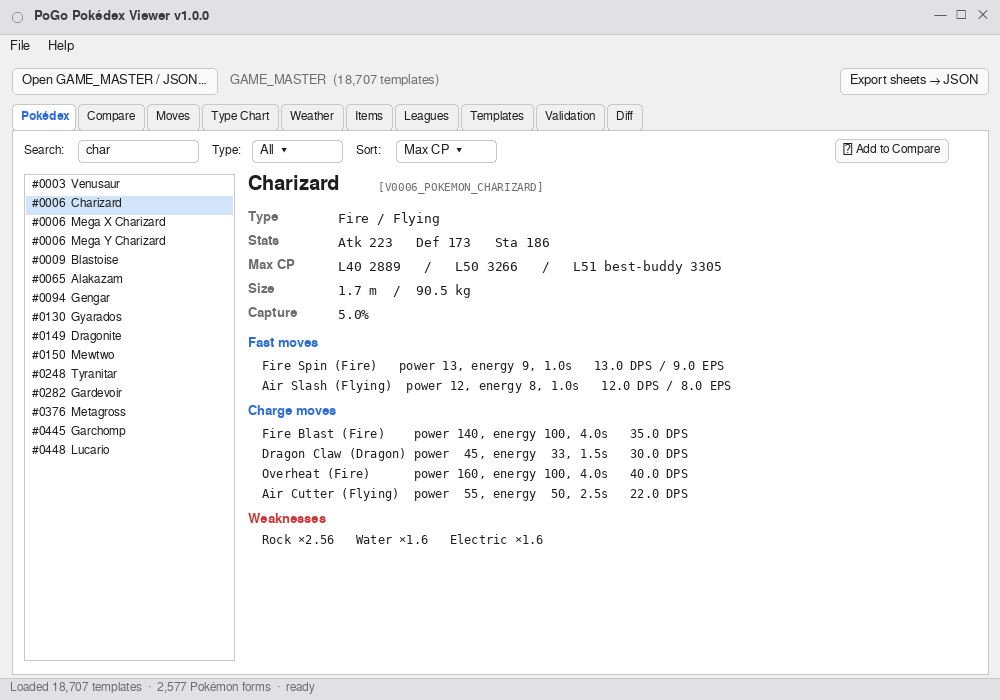
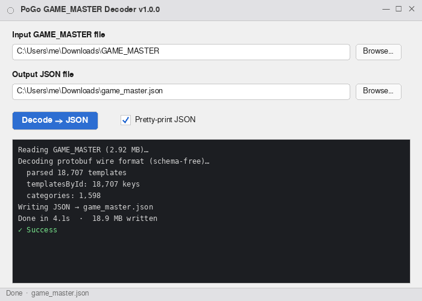

<h1 align="center">PoGo GAME_MASTER Tools</h1>

<p align="center">
  <br>
  <b>Decode the Pokémon GO <code>GAME_MASTER</code> file to clean JSON, and verify it in a Pokédex viewer.</b>
</p>

<p align="center">
  
  
  
  
</p>

Two apps in one project:

| App | What it does |
|---|---|
| **GAME_MASTER Decoder** | Turns the binary `GAME_MASTER` into clean, schema-free JSON |
| **Pokédex Viewer** | Reads that data into readable, verifiable info sheets (stats, moves, types, CP, weather, items, leagues, diffs…) |

| Pokédex Viewer | GAME_MASTER Decoder |
|:---:|:---:|
|  |  |

<sub>UI mockups for illustration — generated by <a href="docs/make_mockups.py"><code>docs/make_mockups.py</code></a>, not live captures. Counts reflect a real decode of a current GAME_MASTER (18,707 templates / 2,577 Pokémon forms).</sub>

The classic decoders (e.g. the old
[`pogo-game-master-decoder`](https://github.com/apavlinovic/pogo-game-master-decoder)
and the JSON-era Silph Road / PoGoHub guides) target the *legacy* GAME_MASTER
format. Modern GAME_MASTER files are a **binary protobuf**, so those tools just
produce garbage or crash. This project fixes that.

## Download

Grab the latest prebuilt apps from the
[**Releases**](https://github.com/ignacioboni-blip/pogodecode/releases) page —
standalone binaries for **Windows**, **macOS** and **Linux**, no Python needed:

- `PoGoGameMasterDecoder` — decode → JSON
- `PoGoPokedexViewer` — browse / verify

> Windows SmartScreen may warn on first run because the binaries aren't
> code-signed (signing needs a paid certificate). Click *More info → Run anyway*,
> or build from source yourself (below).

## Quickstart

```bash
# no dependencies; Python 3.8+
python -m pogodecode.cli GAME_MASTER -o game_master.json     # decode to JSON
python -m pogodecode.dexcli GAME_MASTER --name CHARIZARD     # read a sheet
python -m pogodecode.viewer                                   # launch the GUI
```

## Why it doesn't go out of date

Niantic does **not** publish the `.proto` schema for GAME_MASTER, and they
reshuffle fields with almost every client update — which is exactly why
schema-bound decoders rot.

This decoder reads the **protobuf wire format directly** (pure standard
library, no schema). It cannot break when Niantic adds or moves a setting:

- **Template IDs are exact** — they are plain strings stored in the file
  (e.g. `V0003_POKEMON_VENUSAUR`, `COMBAT_SETTINGS`, `EXTENDED_V0001_POKEMON_BULBASAUR`).
- **Settings payloads** are decoded into nested objects keyed by their numeric
  protobuf **field number** (Niantic ships no field names), with values typed
  as ints, floats, strings, nested messages, or base64 for raw binary.

## Output format

```jsonc
{
  "meta": {
    "source": "GAME_MASTER",
    "sizeBytes": 2924749,
    "templateCount": 18707,
    "categoryCount": 1598,
    "skippedEntries": 0,
    "decodedAt": "2026-05-31T07:30:18Z"
  },
  "templatesById": {
    "EXTENDED_V0001_POKEMON_BULBASAUR": {
      "162": {
        "66": { "1": 0.343, "2": 0.35, "3": 0.525 },   // sizes
        "67": { "9": { "1": 19.04, "2": 25.0, "3": 14.0 } }  // stats
      }
    }
  },
  "templates":  [ { "templateId": "...", "data": { ... } } ],  // file order
  "categories": { "POKEMON": ["V0001_POKEMON_BULBASAUR", ...], "MOVE": [...] }
}
```

- `templatesById` — fast lookup by template id (the JSON "API" surface).
- `templates` — every entry in original file order (safe if an id repeats).
- `categories` — template ids grouped by their prefix.
- Binary blobs that aren't text or sub-messages appear as
  `{ "__bytes__": "<base64>" }`.

## Using the Windows app

1. Build or download `PoGoGameMasterDecoder.exe` (see **Building** below).
2. Run it. Click **Browse…** and pick your `GAME_MASTER` file.
3. Choose where to save the JSON (defaults next to the input file).
4. Click **Decode → JSON**. A ~3 MB GAME_MASTER decodes in a few seconds into
   roughly 20 MB of pretty-printed JSON (tick **Minify** for a smaller file).

## Pokédex Viewer (verification tool)

A second app, **`PoGoPokedexViewer.exe`**, reads a GAME_MASTER file (or a JSON
exported by the decoder) and shows a readable info sheet per Pokémon for quick
verification — no field numbers, just names and values:

- Dex number, name, form, **typing**
- **Base stats** (attack / defense / stamina) and **Max CP** at Level 40
- Height / weight and **base catch rate**
- **Fast & charge moves** with type, power, energy and duration
- Evolution candy cost, 2nd-charge-move unlock cost, shadow/purification cost
- **Mega / Primal forms** (incl. Mega X / Mega Y) with their overridden stats
  and typing, listed as their own entries
- **Regional forms** (Alolan / Galarian / Hisuian) — these are normal entries
- **Type matchups** — per-Pokémon weaknesses / resistances, plus a full 18×18
  type-effectiveness chart (its own tab)
- **Move DPS / EPS** on every move, plus a **Moves** tab listing all moves
- **Power-up & CP tables** — candy/stardust to max, CP at L20/30/40/50
- **Validation** tab — a sanity-check report over the whole file (Pokémon with
  no moves, unresolved move IDs, stat/type outliers, etc.)
- **Weather boosts** — per-Pokémon "boosted in: …" plus a weather→types table
- **Buddy distance** and **evolution** (candy cost + resolved target name)
- **Items**, **PvP leagues** (CP caps), **friendship** bonuses tabs
- **Filter / sort / compare** — filter the Pokédex by type, sort by stat or max
  CP, and pin up to 4 Pokémon for a side-by-side compare
- **Templates** tab — search and view *any* decoded template (not just Pokémon)
- **Diff** tab — load a second GAME_MASTER and see exactly what changed between
  updates: added/removed templates and per-Pokémon stat/type/move changes

It works by layering a small, documented field map (`pogodecode/pokedex.py`)
over the schema-free decode. Every mapped field was checked against known
reference values (e.g. Bulbasaur Atk 118 / Def 111 / Sta 128 → Max CP 1115;
Mewtwo catch rate 2%; Sludge Bomb energy −50).

Command line:

```bash
python -m pogodecode.dexcli GAME_MASTER --name CHARIZARD   # print a sheet
python -m pogodecode.dexcli GAME_MASTER --moves            # list every move
python -m pogodecode.dexcli GAME_MASTER --type-chart       # effectiveness matrix
python -m pogodecode.dexcli GAME_MASTER --validate         # sanity-check report
python -m pogodecode.dexcli GAME_MASTER --weather          # weather -> types
python -m pogodecode.dexcli GAME_MASTER --items            # item list
python -m pogodecode.dexcli GAME_MASTER --leagues          # PvP CP caps
python -m pogodecode.dexcli GAME_MASTER --search FRIENDSHIP # find templates
python -m pogodecode.dexcli GAME_MASTER --template COMBAT_SETTINGS
python -m pogodecode.dexcli OLD_GAME_MASTER --diff NEW_GAME_MASTER  # what changed
python -m pogodecode.dexcli GAME_MASTER --export sheets.json
```

Library:

```python
from pogodecode.pokedex import load_pokedex
dex = load_pokedex("GAME_MASTER")            # raw file OR decoded .json
print(dex.sheet("V0006_POKEMON_CHARIZARD"))
```

> **Where Mega forms live:** Megas are *not* separate Pokémon templates. They
> are stored as temporary-evolution overrides (field 51) inside the base
> species template, so the viewer reads them from there and lists them
> separately (e.g. "Mega Y Charizard").
>
> **Not in GAME_MASTER at all:** "found in wild / raids / research" and spawn
> locations are **not** in this file. GAME_MASTER is a static config of game
> *mechanics* (stats, moves, costs, CP tables). Raid rotations, wild spawn
> pools and research rewards are event-driven, server-side data that Niantic
> changes weekly — no decoder can extract them from GAME_MASTER. The only
> spawn-related value present is gender ratio.

## Building the .exe (on Windows)

```bat
build_windows.bat
```

This creates a virtual environment, installs PyInstaller, and produces two
self-contained files that need no Python on the target machine:

- `dist\PoGoGameMasterDecoder.exe` — decode GAME_MASTER → JSON
- `dist\PoGoPokedexViewer.exe` — browse stats / moves / etc.

(Equivalent manual step: `pyinstaller pogodecode.spec`.)

## Command-line use (any OS)

No dependencies — just Python 3.8+:

```bash
python -m pogodecode.cli GAME_MASTER -o game_master.json --stats
python -m pogodecode.cli GAME_MASTER --minify          # compact output
```

## As a Python library

```python
from pogodecode import decode_game_master, write_json

result = decode_game_master("GAME_MASTER")
write_json(result, "game_master.json")

venusaur = result["templatesById"]["V0003_POKEMON_VENUSAUR"]
```

## Where to get a GAME_MASTER file

The file ships inside the Pokémon GO app's downloaded assets. Community guides
explain how to pull it from the device cache:

- https://www.reddit.com/r/TheSilphRoad/comments/5r9kvd/guide_how_to_extract_decode_the_game_master_file/
- https://pokemongohub.net/post/guide/guide-decode-pokemon-go-game_master-file/

## Running the tests

```bash
pip install pytest
pytest                                   # unit tests (no fixtures needed)
POGO_GAME_MASTER=/path/to/GAME_MASTER pytest   # also runs the integration test
```

## Project layout

```
pogodecode/
  protobuf_decoder.py   schema-free protobuf wire-format decoder
  gamemaster.py         GAME_MASTER structure -> JSON-ready dict
  pokedex.py            field map: decoded data -> named Pokémon/move sheets
  cli.py                decoder command-line entry point
  dexcli.py             Pokédex command-line entry point
  gui.py / viewer.py    Tkinter UIs (decoder / Pokédex viewer)
  _icon.py / _config.py embedded icon + remembered-folder helper
run_gui.py              decoder app entry point
run_viewer.py           viewer app entry point
pogodecode.spec         PyInstaller build spec (builds both apps)
version_info.txt        Windows .exe version metadata
build_windows.bat       one-click Windows build
.github/workflows/      CI: lint, test, build Win/macOS/Linux, release on tags
tests/                  unit + integration tests
```

## Contributing & releases

- Run `pytest` and `pyflakes pogodecode` before sending a change.
- Tag a release with `git tag v1.0.0 && git push --tags`; CI builds the
  binaries for all three platforms and attaches them to the GitHub Release.
- Version history lives in [CHANGELOG.md](CHANGELOG.md).

## License

[MIT](LICENSE). Pokémon and Pokémon GO are trademarks of Nintendo / The Pokémon
Company / Niantic. This is an unofficial fan tool, not affiliated with or
endorsed by them, and it ships **no** game data — it only decodes a
`GAME_MASTER` file you already possess.
